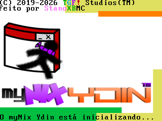

# myNix Ydin

myNix Ydin é um sistema operacional feito tanto por uma pessoa, quanto por uma IA, o Claude.

Isso foi feito para mostrar que, com paciência, você pode criar um ótimo sistema operacional. (se der errado eu vou apagar essa linha)

# Como baixar
Vá em 'Releases', lá você poderá baixar o código-fonte e a ISO! Tudo em .rar, afinal eu tô com preguiça de enviar arquivos pra cá.

# Como inicializar em seu PC
Use Ventoy. Mas ei, desativa seu drive local na BIOS, eu não me responsabilizo por qualquer dano que acontecer no teu PC... Afinal isso aqui tá na pre-alpha.

# Autor + Copyright

Feito por StanoXBMC

(C) 2019-2026 TGF! Studios(TM)

# Testado em

Positivo Master D380 (desktop que usei pra desenvolver este OS)

   Placa-mãe: POS-PIH81DL

   CPU: Intel i5-4590

   RAM: 16 GB

   OS: Windows 10 (com WSL2, Ubuntu)

# Vai ser usado no futuro como

Base pro αlphaβetaOS (caso o myNix Ydin funcione normalmente)
